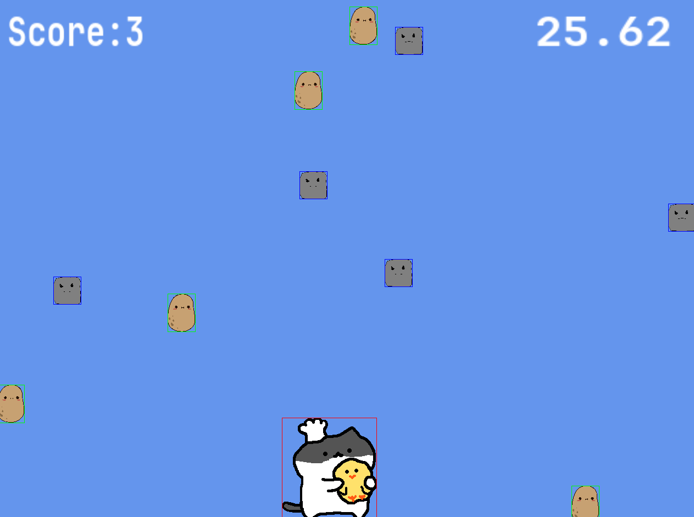

A simple catch/avoid falling objects game written in C using SDL3 for rendering and input. To play the game on itch.io, visit [https://luin213.itch.io/cat-catch](https://luin213.itch.io/cat-catch)



# dependencies
* C23
* Cmake 3.28
* Emscripten (for web build only)
* SDL3
* SDL3_ttf
* SDL3_image

SDL3 libraries can be installed on machine or used via git submodules in the ./vendored directory. By default building locally with cmake/make used SDL3 that is installed on your machine and Emscripten uses the vendored libraries.
This behavior can be changed by changing the value for USE_SDL3_SUBMODULES in ./CMakeLists.txt

# Building for local
I used Cmake and make to build for local runs
```
cd build
cmake ..
make clean && make
```

# Building for Web
I used Emscripten and Cmake for building to web

```
cd build/web 
emcamke cmake ../..
emmake make
```

# Run web build locally
```
emrun --browser "/mnt/c/Program Files/Google/Chrome/Application/chrome.exe" simple.html

```

## Uploading to Itch.io
When uploading files to itch.io, need to rename the .html file to `index.html` 
